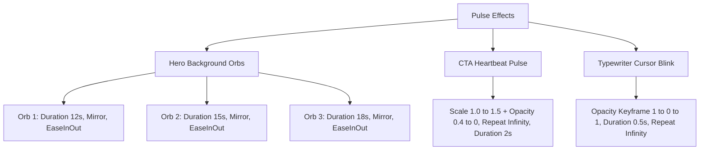

# Medileo Healthcare - Frontend & Motion System Audit

This report provides a structured audit of all global animation systems, visual effects, page transitions, scroll triggers, card hover states, and micro-interactions currently implemented across the Medileo Healthcare codebase. 

---

## 1. Global Animation Systems

Medileo Healthcare uses a hybrid animation architecture composed of **Framer Motion (React wrappers)** for complex interactive sequences and **Vanilla CSS / Tailwind transition utilities** for standard state updates (such as nav link colors and simple card shadows).

### Fade Animations
* **Standard Fade-Up (`fadeInUp`):** Declared in [pages/index.js](file:///c:/Users/dell/medileo%20website/pages/index.js#L7-L14), [pages/about.js](file:///c:/Users/dell/medileo%20website/pages/about.js#L6-L13), and [pages/contact.js](file:///c:/Users/dell/medileo%20website/pages/contact.js#L6-L13). It fades and translates elements upward:
  * `initial` (hidden): `opacity: 0`, `y: 30`
  * `animate` (visible): `opacity: 1`, `y: 0`
  * Timing: `duration: 0.6`, `ease: "easeOut"`
* **AnimatePresence Fades:** 
  * The mobile menu in [components/Navbar.js](file:///c:/Users/dell/medileo%20website/components/Navbar.js#L80-L110) slides and fades via `initial={{ height: 0, opacity: 0 }}` and `animate={{ height: "auto", opacity: 1 }}` over a duration of `0.3s`.
  * The blinking cursor in [components/TypewriterText.js](file:///c:/Users/dell/medileo%20website/components/TypewriterText.js#L50-L76) fades out using `exit={{ opacity: 0 }}` over `0.5s`.

### Reveal Animations
* **Word-by-Word Hero Headline Reveal:** Slices the headline "Pioneering Pharmaceutical" into individual spans that fade in and slide up sequentially (delay: `0.2 + i * 0.1`s) to create an organic, structured text entrance.
* **Typewriter Character Reveal:** The custom [TypewriterText.js](file:///c:/Users/dell/medileo%20website/components/TypewriterText.js) component renders character-by-character reveals using a `setInterval` loop with an interval speed of `150ms`.
* **Staggered Card Reveals:** The grid cards in [FocusAreas (index.js)](file:///c:/Users/dell/medileo%20website/pages/index.js#L144-L173) slide in from `y: 28` with a scale of `0.96` to `1.0` using a staggered viewport-triggered delay: `delay: 0.3 + idx * 0.1`.

### Transition Systems
* **Cubic-Bezier Easing:** Staggered components utilize `ease: [0.25, 0.46, 0.45, 0.94]` (equivalent to `easeOutQuad` / `easeOutQuart` variant), providing a deceleration profile that feels natural.
* **CSS Transitions:** Standard hoverable links and elements use Tailwind transition utility classes (e.g. `transition-colors`, `transition-all`) or native CSS transitions (e.g. `.product-card` has `transition: transform 0.3s ease, box-shadow 0.3s ease`).

### Hover & Delay Systems
* **Dynamic Hover Scale & Shadow:** Interactive elements use `whileHover` to scale upward and cast soft, colored shadows (e.g., Primary CTA button scales to `1.03` with a teal-colored shadow).
* **Sequential Delays:** Handled via index multiplication (e.g., `0.3 + idx * 0.1`) for grids, ensuring layout elements load in sequence rather than popping in simultaneously.

### Pulse Effects


### Reusable Animation Utilities (CSS & Gradients)
* **`.hero-gradient`:** Set in [styles/globals.css:L41-L56](file:///c:/Users/dell/medileo%20website/styles/globals.css#L41-L56), this sets a linear background (`#00152b` to `#008b83`) with a soft overlay spotlight using a `radial-gradient(circle at 80% 20%, rgba(20, 184, 166, 0.15), transparent 40%)`.
* **`.glass-card` & `.glass-search-container`:** Standardized glassmorphism backing (`background: rgba(255, 255, 255, 0.95); backdrop-filter: blur(10px);`).
* **`.hero-wave`:** An absolute bottom wave mask rendered via a embedded SVG file mask pattern to divide the Hero and Stats panels.

---

## 2. Framer Motion Capability Audit

The project uses `framer-motion` v12. A checklist of current usage and easy-to-integrate upgrades is detailed below:

| Feature / Page Area | Current Status | Recommended Upgrade Path | Compatibility Level |
| :--- | :--- | :--- | :--- |
| **Desktop Nav Active Indicator** | Static CSS underline `.active::after` | Replace with a `motion.div` using `layoutId="activeUnderline"` to allow the line to slide horizontally between links. | **High** (Instant compatibility) |
| **Mobile Menu List Items** | Instantly visible on height container transition | Add staggered transition delay to individual menu links (`initial={{ x: -10, opacity: 0 }}`) when parent menu opens. | **Medium** (Quick addition) |
| **Hero Headline text** | Word-by-word staggered entrance | Fully animated on load. Already leverages motion tags. | **Fully Configured** |
| **CTA Buttons** | Scales, shadow shifts, pulsing ring | Fully animated on load, hover, and tap. | **Fully Configured** |
| **Stats Count-up** | Custom `requestAnimationFrame` and `useInView` | Works smoothly. No updates needed. | **Fully Configured** |
| **Focus Cards Grid** | Staggered fadeUp and scale-in reveal | Fully animated. Hover lift and shadow glows configured. | **Fully Configured** |
| **Pillars Cards (About)** | basic `whileInView` fadeUp | Staggered child elements instead of independent viewport triggers to ensure sequential left-to-right entrance. | **Medium** (Layout is ready) |
| **Product Cards Grid** | Layout-animated with basic entry scale | Wrap grid in `<AnimatePresence mode="popLayout">` to animate card additions/removals smoothly during filter updates. | **High** (Requires no markup shifts) |
| **Contact Form Inputs** | Standard Tailwind focus transitions | Add float-up label motion on focus, and subtle input borders pulsing on validation errors. | **Medium** |

---

## 3. Header Interactions

The header contains standard branding and responsive menus. The detailed interaction systems are outlined below:

### Navbar Hover Effects
* Hovering over a navigation link (`.nav-link`) triggers a transition from dark slate (`#1e293b`) to brand teal (`#00B4A9`). This is implemented via CSS transition: `transition: color 0.3s ease;` (defined in [globals.css:L134-L146](file:///c:/Users/dell/medileo%20website/styles/globals.css#L134-L146)).

### Underline Animations
* Active link states use a static CSS pseudo-element:
  ```css
  .nav-link.active::after {
    content: '';
    position: absolute;
    bottom: -4px;
    left: 0;
    width: 100%;
    height: 2px;
    background-color: #0f766e;
  }
  ```
* There is no motion transition when switching routes; the underline snaps into place immediately upon page hydration.

### Sticky Behavior
* The `<header>` element uses `sticky top-0 z-40 shadow-sm w-full`. 
* The background opacity is solid `bg-white` and does not change state, shrink, or fade when the user scrolls down the page.

### Mobile Menu Interactions
* **Trigger:** A hamburger icon buttons swaps SVG shapes to a cross (`X`) using a conditional React state flag (`mobileOpen`).
* **Menu Transition:** Wrapped in `AnimatePresence` and a `motion.nav` element.
  * Transitions: `initial={{ height: 0, opacity: 0 }} animate={{ height: "auto", opacity: 1 }} exit={{ height: 0, opacity: 0 }}`.
  * Easing: Standard ease over a duration of `0.3s`.
* **Mobile Links:** Active links display a solid left border (`border-l-4 border-[#0f766e] pl-3`), while inactive hoverable states shift padding (`pl-4`) and color.

---

## 4. Hero Section Effects

The Hero section on the Home page is the most visually complex interface, utilizing stacked CSS and Framer Motion effects.

```
+-------------------------------------------------------------+
|  .hero-gradient (linear-gradient + radial spotlight)        |
|                                                             |
|   [*] Orb 1 (x/y float, 12s)                                |
|                                 [*] Orb 3 (x/y float, 18s)  |
|                                                             |
|   [Pioneering] [Pharmaceutical] [Excellence (Typewriter)]   |
|   (Staggered reveal)             (Cursor blink + fadeout)   |
|                                                             |
|   [Explore Portfolio]   [Corporate Profile]                 |
|   (Pulse ring + hover)  (Blur + scale hover)                |
|                                                             |
|   [*] Orb 2 (x/y float, 15s)                                |
|                                                             |
|  .hero-wave (Bottom SVG Mask)                               |
+-------------------------------------------------------------+
```

### Gradient Backgrounds & Layered Effects
* **Dual Layer Gradient:** Uses `.hero-gradient` as its baseline backdrop with an absolute radial overlay to focus brightness in the top-right corner.
* **Curved Line Accent:** A decorative arc (`.curved-line`) arches across the right third of the Hero, styled with a low opacity teal border (`rgba(20, 184, 166, 0.2)`).
* **Floating Background Orbs:** Three absolute-positioned radial gradient orbs move on infinite mirror loops:
  * **Orb 1 (Top Left, Teal):** `duration: 12`, `animate={{ x: [0, 20, -10, 0], y: [0, -15, 10, 0] }}`
  * **Orb 2 (Bottom Right, Light Teal):** `duration: 15`, `animate={{ x: [0, -15, 10, 0], y: [0, 20, -10, 0] }}`
  * **Orb 3 (Middle Right, Dark Teal):** `duration: 18`, `animate={{ x: [0, 10, -20, 0], y: [0, -10, 15, 0] }}`

### Reveal Choreography
1. **Headline Phase (0.0s - 0.5s):** The words "Pioneering" and "Pharmaceutical" slide up (`y: 30` to `y: 0`) and fade in at delays of `0.2s` and `0.3s` respectively.
2. **Body Phase (0.7s):** The paragraphs of copy fade in and slide up (`y: 20` to `0`) with a duration of `0.6s`.
3. **Buttons Phase (0.95s):** The CTA buttons group enters with a quick ease-out slide.
4. **Typewriter Phase (1.2s - 2.7s):** "Excellence" begins typing character-by-character (150ms per character).
5. **Cursor Phase (2.7s - 4.2s):** The cursor blinks at 0.5s intervals for 1.5s post-typing, then fades away.

### CTA Hover Interactions
* **Primary Button:** 
  * *Idle:* A hidden teal ring (`motion.span`) pulses behind the button: `animate={{ scale: [1, 1.5], opacity: [0.4, 0] }}` continuously.
  * *Hover:* Scales to `1.03` with a bright drop shadow (`0 10px 25px -5px rgba(20,184,166,0.4)`).
  * *Tap:* Scales down to `0.97`.
* **Secondary Button:**
  * *Hover:* Scales to `1.02` and fades in a transparent background tint (`rgba(20, 184, 166, 0.15)`).
  * *Tap:* Scales down to `0.97`.

---

## 5. Scroll Reveal System

The scroll reveal architecture does not rely on a standalone `ScrollRevealWrapper` wrapper component. Instead, it utilizes two primary Framer Motion approaches:

### Hook-based Reveals (`useInView`)
Used in [pages/index.js](file:///c:/Users/dell/medileo%20website/pages/index.js) to trigger specific animations when areas scroll into view:
* **Stats Section:** Triggered when the component is 50% in view (`amount: 0.5`, `once: true`). It runs the custom count-up loop and fades labels in.
* **Focus Areas Section:** Triggered when 20% in view (`amount: 0.2`, `once: true`). 
  * "Therapeutic Focus" label triggers at `0.0s` delay.
  * "Core Specialties" header triggers at `0.1s` delay.
  * Description paragraph triggers at `0.2s` delay.
  * Grid cards reveal with staggered offsets: `delay: 0.3 + idx * 0.1` (staggering from 0.3s up to 0.6s).

### Declarative Viewport-based Reveals (`whileInView`)
Used in [pages/about.js](file:///c:/Users/dell/medileo%20website/pages/about.js) and [pages/contact.js](file:///c:/Users/dell/medileo%20website/pages/contact.js) for simple scroll reveals:
* **Pillars Card Grid:** Cards reveal using `whileInView={{ opacity: 1, y: 0 }} viewport={{ once: true }}` with a staggered delay calculated per card (`delay: idx * 0.15`).
* **Contact Cards & Form:** Reveal using the `fadeInUp` variant (`hidden` to `visible` transitions triggered via viewport detection).

---

## 6. Card Interaction Systems

The website implements five distinct card layout profiles, each with its own interaction dynamics:

### 1. Therapeutic Specialty Cards (Home)
* **Hover Lift:** Translates upward on hover by `-6px` (or `-3px` on mobile screens) over a `0.25s` duration.
* **Shadow Transition:** Replaces the default light gray border with a custom box-shadow combo:
  * Left vertical indicator border: `-2px 0 0 0 #14b8a6`
  * Outer drop shadow: `0 20px 25px -5px rgba(20,184,166,0.1), 0 8px 10px -6px rgba(20,184,166,0.1)`
* **Emoji Icon Backing:** The emoji wrapper changes background color from `#f8fafc` to `#E0F2F1` (`group-hover:bg-[#E0F2F1]`). 
* **Variant Bug:** The emoji itself has `variants={{ hover: { scale: 1.18 } }}`, but it does not scale up on hover because the parent card does not declare `whileHover="hover"`, preventing variant propagation down to the child elements.

### 2. Product Cards (Products Portfolio)
* **Hover Lift & Shadow:** Driven entirely by CSS classes defined in [globals.css:L113-L126](file:///c:/Users/dell/medileo%20website/styles/globals.css#L113-L126). On hover, translates upward by `-4px` and deepens shadow.
* **Design Accents:** Displays a static, transparent `Rx` prescription mark in the top-right corner.

### 3. Corporate Pillars Cards (About Us)
* **Hover State:** Relies on standard CSS shadow shifts (`hover:shadow-xl transition-all`). Cards remain static (no translation or scaling).
* **Reveal Delay:** Staggered sequence `idx * 0.15` (0.0s, 0.15s, 0.3s) triggered on scroll.

### 4. Registered Office & Mailroom Cards (Contact)
* **Hover State:** Completely static. No hover effects are applied.
* **Reveal Delay:** Fade up on viewport enter via standard `fadeInUp` variants.

### 5. Stats Cards (Home Dashboard)
* **Hover State:** Static card layout. The numbers themselves are dynamic, counting up from 0 to the target value when scrolled into view.

---

## 7. Typography Motion & Visual Hierarchy

```
[Playfair Display (Serif)]  --> Academic Authority, Clinical Trust, Premium Editorial
[Inter (Sans-Serif)]        --> Modern Cleanliness, High Readability, Precision Tech
[Monospace Fonts]           --> Formulaic Composition, Chemical/Clinical Indexes
```

### Font Hierarchy
* **Headings (`h1`, `h2`, `h3`, `h4`):** Styled with Playfair Display (`--font-playfair`) with a default letter spacing of `0.03em`. This serif selection evokes a traditional, academic, and clinical trust profile.
* **Body copy:** Uses Inter (`--font-inter`) for clean legibility and modern technical aesthetics.
* **Specialist Code/Compositions:** Uses standard monospace fonts (`font-mono`) to display chemical formula layouts, mimicking laboratory logs.

### Animated Typography & Timing
* **Headline Entrances:** Splitting words into individual elements prevents abrupt flashes, letting letters slide smoothly from `y: 30` to `y: 0` in `0.6s`.
* **Typewriter Speed:** A deliberate pacing of `150ms` per character prevents the text from drawing too fast, ensuring readability.
* **Stats Counter Easing:** The number counter ticks use a custom easing equation:
  ```javascript
  function easeOutQuart(x) {
    return 1 - Math.pow(1 - x, 4);
  }
  ```
  This creates a rapid count-up at the start that slows down significantly near the end, providing high-fidelity motion feedback.

---

## 8. Utility Classes

The following custom utility classes are configured in [globals.css](file:///c:/Users/dell/medileo%20website/styles/globals.css):

* **Gradients & Backgrounds:**
  * `.hero-gradient`: Sets the background gradient and handles pointer spotlight overlays.
  * `.hero-wave`: Places the SVG curved divider as a mask at the bottom of the section.
  * `.curved-line`: Top-right arching container outline (`border-right: 2px solid rgba(20, 184, 166, 0.2)`).
* **Glassmorphism:**
  * `.glass-card`: Base white card with backdrop filter blur (`10px`).
  * `.glass-search-container`: High opacity white searching bar.
* **Watermarks:**
  * `.rx-watermark`: Watermark background text (`Rx`) for medical card layouts.
* **Cards & Links:**
  * `.product-card` / `.product-card:hover`: Manages positioning, padding, shadows, and lifts.
  * `.nav-link` / `.nav-link:hover` / `.nav-link.active`: Sets spacing, typography weights, color transitions, and the active state bottom bar.

---

## 9. UX & Motion Quality Analysis

### What Already Feels Premium
* **Hero Entrance:** The combination of floating background orbs, staggered slide-up headings, and a typing animation of the word "Excellence" creates a high-fidelity visual experience.
* **Stats Counter Easing:** Using `requestAnimationFrame` with `easeOutQuart` deceleration is superior to standard `setInterval` count-ups, ensuring sub-pixel alignment and smooth counting.
* **Therapeutic Cards (Home):** The combination of a lift, shadow expansion, and left-border glow makes the cards feel responsive and tactile.

### What Feels Template-like
* **Contact Info Cards:** They fade in on scroll but have no hover states, making them feel rigid compared to the home page cards.
* **Product Card Transitions:** Using standard CSS classes for hover transitions makes them look like boilerplate templates compared to the custom Framer Motion variants used on the Home page.

### repetitive Animations & Weak Motion Hierarchy
* **Repetitive Entrances:** Every text header and grid card uses a nearly identical fade-up animation (`y: 30` to `y: 0`, opacity `0` to `1` over `0.6s`).
* **Stats Bar Counter Clash:** The counter numbers animate instantly when scrolling into view, while the descriptive labels below them slide up with a delay. Having numbers count up while their labels are moving upward creates some visual clutter.

### Missing Interaction Depth (Bugs/Omissions)
* **Broken Emoji Scaling:**
  * *Location:* [FocusAreas (index.js:L158-L164)](file:///c:/Users/dell/medileo%20website/pages/index.js#L158-L164)
  * *Issue:* The emoji container has a variant defined to scale up the emoji on hover (`variants={{ hover: { scale: 1.18 } }}`). However, the parent card (`motion.div` in line 146) does not declare `whileHover="hover"`. As a result, the variant name does not propagate, and the emoji does not scale on hover. Only the background color shifts.
* **Static Navbar Underline:** The active nav link underline is a static CSS pseudo-element (`::after`). Swapping pages causes the line to snap instantly rather than sliding between active elements.
* **Abrupt Mobile Menu Toggle:** The hamburger icon swaps SVG paths instantaneously with no rotation or morphing transitions.

---

## 10. Final Summary

* **Current Frontend Maturity Level:** **7.5 / 10**
  * *Rationale:* Built using Next.js, React 19, and Tailwind 4. Layouts are clean, responsive, and utilize sophisticated typography pairings (Playfair Display + Inter) that fit clinical and medical aesthetics.
* **Current Animation Maturity Level:** **6.5 / 10**
  * *Rationale:* High-fidelity animations are concentrated on the Home page. The remaining pages (Products, About, Contact) use basic viewport reveals or simple CSS transitions, creating an inconsistent user experience.

### Section Ratings
* **Strongest UI Sections:**
  * **Hero Section:** Well-choreographed text entrances, floating orbs, and clean CTA pulsing.
  * **Stats Section:** Smooth, eased scroll counters.
  * **Therapeutic Grid:** Interactive hover states and custom border glows.
* **Weakest UI Sections:**
  * **Mobile Menu:** Lacks animations and path-morphing triggers.
  * **Products Filtering:** Cards snap abruptly during searches instead of fading or repositioning.
  * **Contact Cards:** Lack hover states, making them feel like placeholders.

### Safest Files & Areas to Upgrade
1. **[components/Navbar.js](file:///c:/Users/dell/medileo%20website/components/Navbar.js):** Safe to upgrade link underlines to Framer Motion `layoutId` sliding indicators and add staggered lists for the mobile menu.
2. **[pages/index.js](file:///c:/Users/dell/medileo%20website/pages/index.js):** Safe to fix the emoji scaling issue by adding `whileHover="hover"` to the cards.
3. **[pages/products.js](file:///c:/Users/dell/medileo%20website/pages/products.js):** Safe to integrate an `<AnimatePresence>` wrapper around the product grid to allow smooth filtering transitions.
